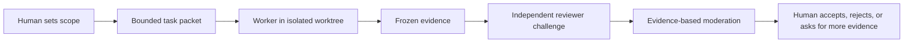

# Meaning Assurance

**Evidence-based adversarial review for coding agents — by LEVIUS**

[简体中文](README.zh-CN.md) · [Run the demo](#see-the-decision-trail-in-one-command) · [Brainstorm a strategy](#strategic-planning-brainstorm) · [Inspect a real audit](#a-real-first-party-evidence-case) · [Read the protocol](docs/PROTOCOL.md)

> **v0.2.0 release candidate:** this branch is a local build. It has not been
> published, tagged, or released.

## Your coding agent says: “Done.”

**Do you believe it?**

What evidence did it leave? Who challenged the claim? When a second agent says
“looks good,” did it independently verify the work—or merely repeat the same
confidence?

Coding agents are good at producing answers. They should not have the authority
to approve themselves.

**Meaning Assurance** is a local-first, file-backed protocol that separates:

- what a worker claims;
- what the frozen evidence shows;
- what a reviewer challenges;
- what a moderator can verify; and
- what a human finally accepts.

> **Agents propose. Evidence is verified. Humans decide what to accept.**

No hosted control plane · No stored provider API keys · No automatic merge ·
Human final authority

## See the decision trail in one command

Clone the repository, then run:

```powershell
powershell -NoProfile -ExecutionPolicy Bypass -File .\scripts\Run-Demo.ps1
```

The deterministic demo:

- needs no API key and launches no external agent;
- does not modify an existing repository;
- copies a fixed evidence packet into a new temporary output folder;
- shows one worker claim, four reviewer findings, moderation outcomes, and a
  human-controlled final state; and
- writes SHA-256 hashes so the copied evidence can be checked.

Expected decision summary:

```text
Worker claim: COMPLETE
Evidence: one declared test is missing; one changed file is outside scope
Review outcomes: 2 confirmed, 1 rejected, 1 not testable
Final acceptance: BLOCKED
```

[Read the five-minute quick start](docs/QUICKSTART.md) ·
[Inspect the demo fixture](examples/demo-fixture/README.md)

## Strategic planning brainstorm

Meaning Assurance can also structure strategic planning before implementation.
Instead of asking one agent for a polished plan and treating confidence as
quality, the controller can run a bounded `strategy-review` discussion that:

- frames the decision, constraints, non-goals, and available evidence;
- generates competing directions instead of one prematurely fixed answer;
- asks reviewers to attack assumptions and produce counter-evidence;
- separates facts, inferences, unknowns, and questions that still need testing;
  and
- records a narrowed route, rejected options, and unresolved disagreements for
  human decision.

```text
Strategic question
→ competing directions
→ adversarial questions
→ evidence and counter-evidence
→ narrowed route
→ human decision
```

> **Planning boundary:** this is structured adversarial brainstorming, not
> automatic strategy selection, market validation, or proof that the chosen
> route will work.

[See the real strategic-planning case](docs/cases/2026-07-25-readme-strategy-review/README.md) ·
[Read the questions and counter-challenges](docs/cases/2026-07-25-readme-strategy-review/strategy-discussion.md)

## A real first-party evidence case

Meaning Assurance has already been used to challenge the communication strategy
of this repository. Claude Code reviewed nine frozen public files. Codex then
challenged the review itself and recorded ten moderated outcomes:

```text
5 confirmed · 2 rejected · 2 duplicate · 1 not testable
```

That distribution matters. The case does not present agent agreement as proof.
It preserves disagreement, rejects unsupported reviewer claims, and keeps
acceptance outside the reviewer.

> **Case boundary:** this is first-party internal dogfooding. It is not a
> third-party audit, independent validation, certification, or proof of product
> effectiveness.

[Open the case](docs/cases/2026-07-25-readme-strategy-review/README.md) ·
[Read the strategy discussion](docs/cases/2026-07-25-readme-strategy-review/strategy-discussion.md) ·
[Inspect the read-only audit](docs/cases/2026-07-25-readme-strategy-review/read-only-audit.md)

## What it changes

Most coding-agent workflows combine production and judgment in the same chat:

```text
prompt → agent output → agent says “done” → human guesses whether to trust it
```

Meaning Assurance makes the boundaries explicit:



The protocol provides:

- bounded task and discussion packets;
- isolated Git worktrees for implementation workers;
- frozen, inventoried, and hashed reference snapshots;
- blind Round 1 review and targeted Round 2 challenge;
- required and optional reviewer gates;
- canonical result files and invalid-output quarantine;
- PID-backed invocation leases that prevent blind duplicate retries;
- explicit `confirmed`, `rejected`, `duplicate`, and `not-testable` outcomes;
- visible unresolved disagreement; and
- no automatic merge or patch application.

## What it is—and is not

| Meaning Assurance is | Meaning Assurance is not |
|---|---|
| A local protocol around coding-agent delegation | A new coding model or chat interface |
| A way to preserve evidence and disagreement | A model-voting system |
| A controller/worker/reviewer/human role contract | A fixed Codex–Claude–Reasonix trio |
| A file-backed audit trail for engineering decisions | A guarantee that the final decision is correct |
| Windows-first and PowerShell-based today | A complete operating-system sandbox |
| Human-controlled at the acceptance boundary | An automatic merge or autonomous approval service |

## Two operating paths

### Read-only strategy or code review

The controller freezes a bounded reference packet. Reviewers inspect copies,
not mutable source paths. A moderator verifies findings, challenges weak
inferences, and records a decision or escalates unresolved disagreement.

### Isolated implementation

An external worker receives a bounded task packet and edits only a dedicated Git
worktree. The collector exposes canonical results and the isolated diff. Nothing
is merged or applied automatically.

[Read the protocol](docs/PROTOCOL.md) ·
[Read the architecture](docs/ARCHITECTURE.md) ·
[See complete synthetic workflows](docs/EXAMPLES.md)

## Requirements

- Windows 10 or later
- Windows PowerShell 5.1 or PowerShell 7
- Git 2.20 or later
- For live workflows, at least one supported CLI adapter:
  - Claude Code through `PATH`, `CLAUDE_CODE_EXE`, or `-ClaudeExe`
  - Reasonix through `PATH`, `REASONIX_COMMAND`, or `-ReasonixCommand`

The deterministic demo does not need a live agent or provider credential.

## Install for live workflows

```powershell
$env:AGENT_WORKBENCH_HOME = Join-Path $env:LOCALAPPDATA "AgentWorkbench"
powershell -NoProfile -ExecutionPolicy Bypass -File .\scripts\Install-AgentWorkbench.ps1
```

The installer preserves existing runtime folders:

```text
tasks/
bugs/
worktrees/
discussions/
```

Live agent credentials remain managed by the agent CLI. Meaning Assurance does
not store provider API keys.

[Continue with the quick start](docs/QUICKSTART.md)

## Public name and compatibility

- **Canonical product brand:** Meaning Assurance
- **Chinese audience-facing alias:** AI 对抗审计助手
- **Public author identity:** LEVIUS
- **Current repository slug:** `agent-workbench`

The product name has changed before the repository slug. A future repository
rename requires separate authorization and migration verification. Existing
technical identifiers remain compatible:

```text
.agent-workbench
AGENT_WORKBENCH_HOME
Install-AgentWorkbench.ps1
existing task, discussion, and evidence field names
```

Brand cleanup is not a reason to create an unnecessary breaking change. See
[Migration and compatibility](docs/MIGRATION.md).

## Privacy and trust boundaries

Runtime folders can contain prompts, source snapshots, paths, diffs, and agent
output. Keep them outside the source checkout and inspect artifacts before
sharing them.

Redaction is defense in depth, not a guarantee. Git worktrees isolate files but
are not operating-system sandboxes. External CLI permissions remain controlled
by each CLI configuration.

[Privacy](docs/PRIVACY.md) ·
[Security](SECURITY.md) ·
[Current limitations](docs/LIMITATIONS.md)

## Test

The repository suite uses temporary repositories and fake agent executables. It
does not require live Claude Code or Reasonix sessions.

```powershell
powershell -NoProfile -ExecutionPolicy Bypass -File .\tests\run-tests.ps1
```

PowerShell 7:

```powershell
pwsh -NoProfile -File .\tests\run-tests.ps1
```

## Project status

Meaning Assurance is a Windows-first public preview. Its public API is not yet
stable, and breaking changes may occur before `1.0.0`.

The v0.2.0 materials in this branch are release candidates, not a published
Release. See [CHANGELOG.md](CHANGELOG.md) and the
[publication boundary](docs/PUBLICATION_READINESS.md).

## Author and contact

- Author ID: **LEVIUS**
- Public contact: [agentworkbench@proton.me](mailto:agentworkbench@proton.me)

See [AUTHORS.md](AUTHORS.md) for the public maintainer record.

## License

Licensed under the Apache License 2.0. See [LICENSE](LICENSE).

---

**Meaning** — *Living-Seeking-Meaning.*

> “Dedicated to all the pioneers.” — *Macross Plus*
