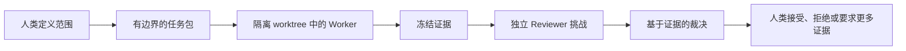

# Meaning Assurance（AI 对抗审计助手）

**面向 Coding Agent 的证据核验与对抗复审机制——作者 LEVIUS**

[English](README.md) · [运行演示](#用一条命令查看完整裁决链) · [战略规划头脑风暴](#战略规划头脑风暴) · [检查真实审计](#第一方真实证据案例) · [阅读协议](docs/PROTOCOL.md)

> **v0.2.0 发布候选：**当前分支正在 Draft PR
> [#2](https://github.com/leviuszen/agent-workbench/pull/2) 中接受审查，尚未合并、打
> Tag 或发布 Release。

## 你的 Coding Agent 说：“完成了。”

**你真的相信吗？**

它留下了什么证据？谁挑战过它的结论？当第二个 Agent 也说“看起来没问题”时，
它是否进行了独立核验，还是只重复了同一种自信？

Coding Agent 擅长生产答案，但不应该拥有批准自己的权力。

**Meaning Assurance（AI 对抗审计助手）**是一套本地优先、以文件为载体的协议，
用于分离：

- Worker 声称完成了什么；
- 冻结证据实际显示了什么；
- Reviewer 提出了哪些挑战；
- Moderator 能够核验什么；以及
- 人类最终接受什么。

> **Agent 提出结果，证据接受核验，人类决定是否采纳。**

无托管控制面 · 不保存供应商 API Key · 不自动合并 · 人类保留最终决定权

## 用一条命令查看完整裁决链

克隆仓库后运行：

```powershell
powershell -NoProfile -ExecutionPolicy Bypass -File .\scripts\Run-Demo.ps1
```

这个确定性演示：

- 不需要 API Key，也不会启动外部 Agent；
- 不修改用户已有仓库；
- 将固定证据包复制到一个新建的临时输出目录；
- 展示一项 Worker 主张、四项 Reviewer Finding、裁决结果和由人类控制的最终状态；
- 写入 SHA-256 哈希，以便检查复制后的证据。

预期摘要：

```text
Worker claim: COMPLETE
Evidence: one declared test is missing; one changed file is outside scope
Review outcomes: 2 confirmed, 1 rejected, 1 not testable
Final acceptance: BLOCKED
```

[阅读五分钟快速开始](docs/QUICKSTART.md) ·
[检查演示 Fixture](examples/demo-fixture/README.md)

## 战略规划头脑风暴

Meaning Assurance 也可以在实施前组织战略规划。它不是让一个 Agent 给出看起来
完整的方案，再把自信当成质量；Controller 可以发起有边界的 `strategy-review`
讨论，用来：

- 明确战略问题、约束条件、非目标和当前证据；
- 生成相互竞争的候选方向，而不是过早固定唯一答案；
- 要求 Reviewer 攻击隐藏假设并提出反证；
- 区分事实、推断、未知项和仍需验证的问题；
- 记录收敛后的候选路线、被驳回方案和未解决分歧，交由人类决定。

```text
战略问题
→ 候选方向
→ 对抗性追问
→ 证据与反证
→ 路线收敛
→ 人类决定
```

> **规划边界：**这是结构化的对抗性头脑风暴，不是自动战略决策、市场验证，
> 也不能证明所选路线一定有效。

[查看真实战略规划案例](docs/cases/2026-07-25-readme-strategy-review/README.md) ·
[阅读问题与反向挑战](docs/cases/2026-07-25-readme-strategy-review/strategy-discussion.md)

## 第一方真实证据案例

Meaning Assurance 已被用于审视本仓库自身的传播策略。Claude Code 基于 9 个
冻结公开文件进行复审，Codex 随后反过来挑战 Reviewer 的结论，并记录 10 项经过
裁决的结果：

```text
5 confirmed · 2 rejected · 2 duplicate · 1 not testable
```

这组分布本身就是重点：案例没有把 Agent 一致意见当成证明，而是保留分歧、驳回
缺乏依据的 Reviewer 判断，并把最终接受权留在 Reviewer 之外。

> **案例边界：**这是第一方内部 dogfooding，不是第三方审计、独立验证、认证，
> 也不是产品有效性证明。

[打开案例](docs/cases/2026-07-25-readme-strategy-review/README.md) ·
[阅读战略讨论](docs/cases/2026-07-25-readme-strategy-review/strategy-discussion.md) ·
[检查只读审计](docs/cases/2026-07-25-readme-strategy-review/read-only-audit.md)

## 它改变了什么

许多 Coding Agent 工作流把生产和判断放在同一个对话中：

```text
提示词 → Agent 输出 → Agent 声称“完成” → 人类猜测是否可信
```

Meaning Assurance 将边界显性化：



协议提供：

- 有明确边界的任务包和讨论包；
- 面向实现 Worker 的隔离 Git worktree；
- 经过清点、冻结和哈希的参考快照；
- blind Round 1 与 targeted Round 2；
- required 与 optional Reviewer gate；
- 规范结果文件和无效输出隔离；
- 防止超时后盲目重复启动的 PID 调用租约；
- `confirmed`、`rejected`、`duplicate` 和 `not-testable` 裁决；
- 可见的未解决分歧；
- 不自动合并，也不自动应用 Patch。

## 它是什么、不是什么

| Meaning Assurance 是 | Meaning Assurance 不是 |
|---|---|
| Coding Agent 委派外围的本地协议 | 新的编码模型或聊天界面 |
| 保存证据和分歧的方法 | 模型投票系统 |
| Controller、Worker、Reviewer 与 Human 的角色合同 | 固定的 Codex–Claude–Reasonix 三件套 |
| 面向工程决策的文件化审计轨迹 | 对最终决定正确性的保证 |
| 当前以 Windows 和 PowerShell 为主 | 完整的操作系统沙箱 |
| 在接受边界保留人工控制 | 自动合并或自主批准服务 |

## 两条工作路径

### 只读战略或代码复审

Controller 冻结有边界的参考包。Reviewer 检查副本，而不是可变的源路径。
Moderator 核验 Finding、挑战弱推断，并记录决定；重大分歧无法解决时交还人类。

### 隔离实现

外部 Worker 接收有边界的任务包，只在专用 Git worktree 中修改文件。Collector
展示规范结果和隔离 diff，不会自动合并或应用任何修改。

[阅读协议](docs/PROTOCOL.md) ·
[阅读架构](docs/ARCHITECTURE.md) ·
[查看完整合成工作流](docs/EXAMPLES.md)

## 环境要求

- Windows 10 或更高版本
- Windows PowerShell 5.1 或 PowerShell 7
- Git 2.20 或更高版本
- 真实工作流至少需要一个受支持的 CLI Adapter：
  - Claude Code：通过 `PATH`、`CLAUDE_CODE_EXE` 或 `-ClaudeExe`
  - Reasonix：通过 `PATH`、`REASONIX_COMMAND` 或 `-ReasonixCommand`

确定性演示不需要真实 Agent 或供应商凭据。

## 安装真实工作流

```powershell
$env:AGENT_WORKBENCH_HOME = Join-Path $env:LOCALAPPDATA "AgentWorkbench"
powershell -NoProfile -ExecutionPolicy Bypass -File .\scripts\Install-AgentWorkbench.ps1
```

升级时会保留现有运行目录：

```text
tasks/
bugs/
worktrees/
discussions/
```

真实 Agent 凭据仍由 Agent CLI 自己管理。Meaning Assurance 不保存供应商 API Key。

[继续阅读快速开始](docs/QUICKSTART.md)

## 公开名称与兼容关系

- **规范产品品牌：**Meaning Assurance
- **中文受众名称：**AI 对抗审计助手
- **公开作者身份：**LEVIUS
- **当前仓库 slug：**`agent-workbench`

产品名已经更新，但仓库 slug 尚未改名。未来仓库改名必须获得单独授权并完成迁移
验证。以下技术标识继续保持兼容：

```text
.agent-workbench
AGENT_WORKBENCH_HOME
Install-AgentWorkbench.ps1
现有 task、discussion 与 evidence 字段名
```

品牌统一不能成为制造无必要 Breaking Change 的理由。参见
[迁移与兼容说明](docs/MIGRATION.md)。

## 隐私与信任边界

运行目录可能包含提示词、源码快照、路径、diff 和 Agent 输出。应将它们保存在源码
仓库之外，并在分享前人工检查。

脱敏是纵深防御，不是绝对保证。Git worktree 隔离文件，但不是操作系统级沙箱。
外部 CLI 权限仍由各 CLI 自身配置控制。

[隐私说明](docs/PRIVACY.md) ·
[安全策略](SECURITY.md) ·
[当前限制](docs/LIMITATIONS.md)

## 测试

仓库测试使用临时仓库和 Fake Agent，不需要真实 Claude Code 或 Reasonix 会话。

```powershell
powershell -NoProfile -ExecutionPolicy Bypass -File .\tests\run-tests.ps1
```

PowerShell 7：

```powershell
pwsh -NoProfile -File .\tests\run-tests.ps1
```

## 项目状态

Meaning Assurance 当前是 Windows-first Public Preview。公开 API 尚未稳定，
`1.0.0` 之前可能发生 Breaking Change。

当前分支中的 v0.2.0 材料是发布候选，不是已经公开的 Release。参见
[CHANGELOG.md](CHANGELOG.md) 与[发布边界](docs/PUBLICATION_READINESS.md)。

## 作者与联系

- 作者 ID：**LEVIUS**
- 公开联系邮箱：[agentworkbench@proton.me](mailto:agentworkbench@proton.me)

参见 [AUTHORS.md](AUTHORS.md)。

## 许可证

使用 Apache License 2.0，参见 [LICENSE](LICENSE)。

---

**Meaning** — *Living-Seeking-Meaning.*

> “Dedicated to all the pioneers.” — *Macross Plus*
